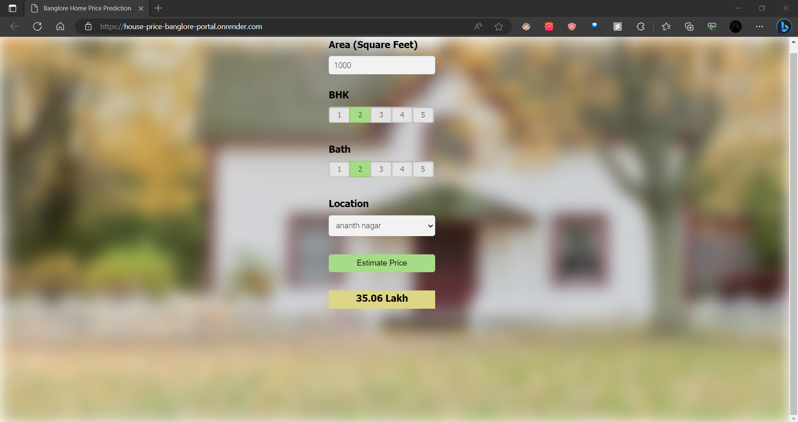

# House Price Prediction

This project aims to develop a web application for house price prediction, providing accurate and intuitive predictions for potential home buyers or sellers. The application utilizes machine learning models trained on a house price dataset, along with data cleaning, outlier detection, and exploratory data analysis (EDA) techniques to ensure accurate predictions and reliable results.

## Features

- Data cleaning and preprocessing: Conducted data cleaning to handle missing values and inconsistencies in the house price dataset. Preprocessed the data to make it suitable for machine learning models.
- Outlier detection: Identified and handled outliers in the dataset to improve the robustness of the models.
- Exploratory data analysis (EDA): Performed EDA to gain insights into the dataset, visualize patterns, and identify relevant features for the prediction task.
- Model training and selection: Trained various machine learning models on the dataset, including regression algorithms such as linear regression, decision tree regression, and random forest regression. Evaluated and selected the most robust and consistent performing model based on cross-validation scores.
- Web application development: Designed and developed a user-friendly web application using Flask, HTML, CSS, and JavaScript. Integrated the trained house price prediction model with the web app to deliver an intuitive interface for accurate estimation.
- Real-time prediction: Allows users to input relevant features of a house (such as area, number of rooms, location, etc.) through the web app and receive real-time predictions on the estimated price.

## Technologies Used

- Python
- Flask
- HTML
- CSS
- JavaScript
- Machine Learning (scikit-learn, pandas, numpy)
- Data Visualization (matplotlib, seaborn)

## Screenshots and Access Link
To access the live version of the house price prediction web application, click the link below:

[House Price Prediction Web App](https://house-price-banglore-portal.onrender.com)

Here is the Screenshot of the working website:




Simply click the link above and it will take you directly to the web application where you can start using it to estimate house prices.

## Usage

1. Clone the repository:

   ```
   git clone https://github.com/MiteshJalan/HousePricePrediction

   ```

2. Install the required dependencies:

   ```
   pip install -r ./server/requirements.txt
   ```

3. Run the Flask development server:

   ```
   python ./server/server.py
   ```

4. Open your web browser and navigate to `http://localhost:5000` to access the house price prediction web application.


- The `server` directory contains the Flask application code, including static files (CSS and JavaScript) and HTML templates for the web interface.
- The `model` directory holds the house price dataset (`house_prices.csv`).
- The `model` directory also stores the trained regression model (`regression_model.pkl`).
- The `utils.py` file contains utility scripts for data preprocessing and model prediction.
- `server.py` is the main entry point of the application.
- `README.md` is this file, providing an overview of the project.
- `requirements.txt` lists the required dependencies for the project.

Feel free to customize the project structure and files as per your needs.

## Conclusion

This project demonstrates the development of a web application for house price prediction. By utilizing machine learning models, data preprocessing, and exploratory data analysis, accurate predictions are provided to potential home buyers or sellers. The user-friendly web

 interface enhances the usability and accessibility of the prediction system.

For any questions or feedback, please feel free to contact me.

Happy predicting!
